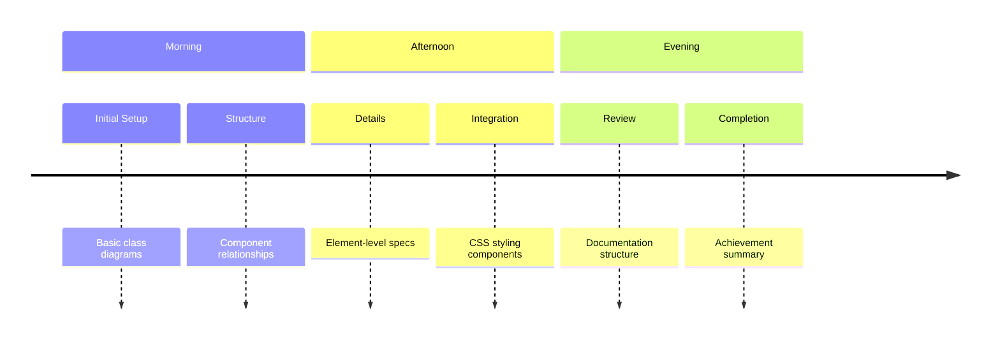
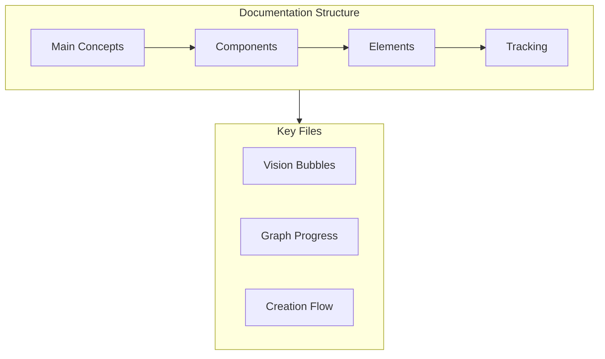

Here’s a concise summary of our conversation today:

---

## Conversation Summary (May 9, 2025)

- **Goal:**  
  Explore how to maintain traceability between a main Mermaid class diagram and detailed subgraphs/flowcharts in Markdown, focusing on the flow from "Dreams" to "Creation".

- **Approach:**  
  - Use unique, consistent names for entities across all diagrams.
  - Reference the main diagram in detailed diagrams using visible Markdown links.
  - Provide three transformation types for the flow:
    1. Flowchart with notes as edges.
    2. Flowchart with subgraphs for class info.
    3. Flowchart plus a bullet list for class info.
  - Add clear references and change management notes for traceability.

- **Best Practices:**  
  - Keep diagrams readable; use bullet lists for detailed class info if needed.
  - Update both main and detailed diagrams when relationships change.
  - Maintain cross-references for easy backtracking.

- **Other Topics:**  
  - Discussed local Mermaid.js setup, common issues, and best practices for rendering diagrams in a local environment.
  - Clarified project organization and documentation structure.

---

## Conversation Summary (May 10, 2025) - Final Update

### Project Evolution

### Major Achievements
1. **Complete System Architecture**
   - Dreams to Creation conceptual flow
   - Component-level technical details
   - Element-level implementations

2. **Documentation Framework**
   - Structured sections (1-11)
   - Clear hierarchy
   - Cross-referenced content

3. **Technical Integration**
   - HTML components (UI layer)
   - JavaScript logic (Processing)
   - CSS styling (Visual presentation)

### Documentation Map

### Next Steps
1. **Consider Adding:**
   - Error handling documentation
   - State management flows
   - Additional interaction patterns

2. **Maintenance:**
   - Regular updates to change log
   - Cross-reference verification
   - Relationship validation

### Related Documents
- [45.1 Vision Bubbles From Dreams to Creation Flow.md](45.1%20Vision%20Bubbles%20From%20Dreams%20to%20Creation%20Flow.md)
- [45 Vision Bubbles From Chaos to Order.md](45%20Vision%20Bubbles%20From%20Chaos%20to%20Order.md)