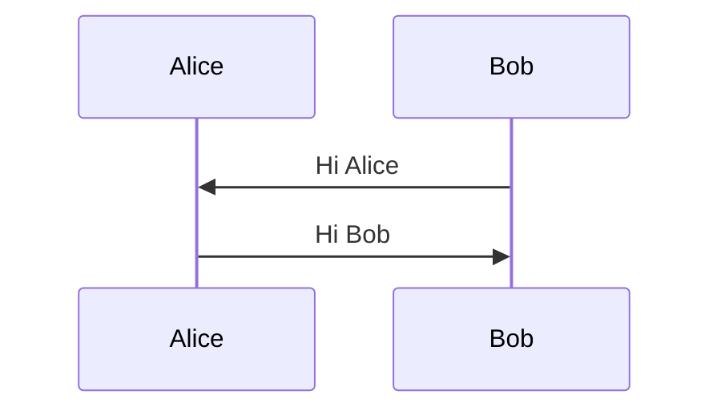
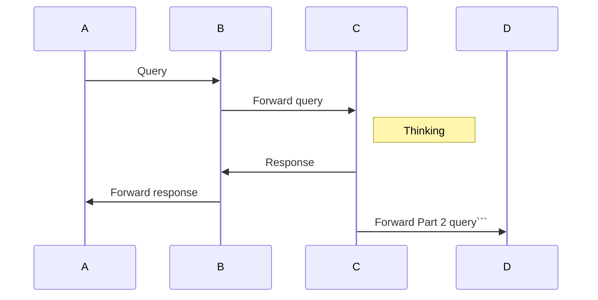
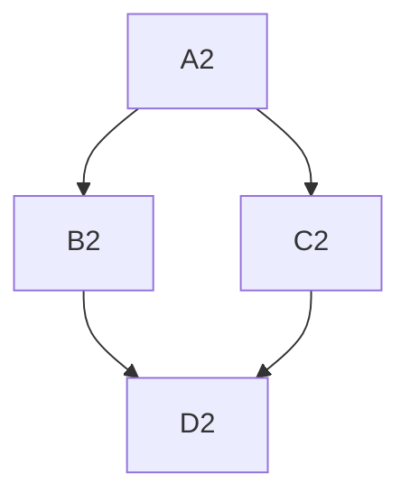
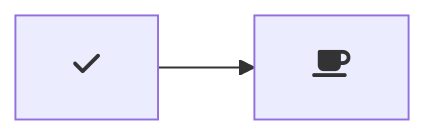

# Basics

## diagram 1

## diagram 2

## diagram 3

## diagram 4

You can also use ::: blocks:

::: mermaid
graph TD;
    A4-->B4;
    A4-->C4;
    B4-->D4;
    C4-->D4;
:::
## diagram 5

Supports MDI and logos icons from Iconify:

```mermaid
architecture-beta
    service user(mdi:account)
    service lambda(logos:aws-lambda)

    user:R --> L:lambda
```

## diagram 6
"markdown.styles": [
    "https://use.fontawesome.com/releases/v5.7.1/css/all.css"
]
## diagram 7

