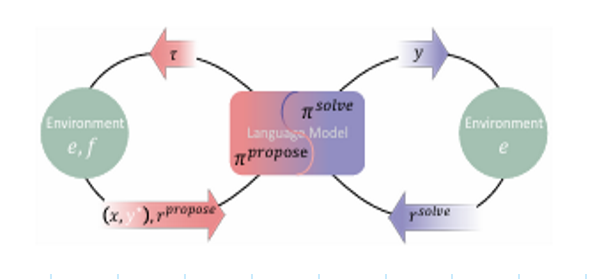

## from chaos to organized order, from real life situations to organized project order.
i want to higlight the partlyflow of "dreams" to "creation" in another graph like flowchart and elaborate on it.
i want to visualize this in mermaid graphs.

AZR LLM Inspiration /visions;
- Started with a Main overview Mermaid graph "45 Vision Bubbles From Chaos to Order" as a baseline.
- Goal: Visions Representation in Mermaid Graphs "45.2 Vision Bubbles From Dreams to Creation Flow" Based On AZR LLM Inspiration /Visions.

## Project Structure

```
PlayGround
├── 45                         # AZR Project Root
│   ├── diagrams              
│   │   ├── chaos-to-order.md  # Main vision Mermaid diagram
│   │   └── dreams-flow.md     # Dreams to Creation flow diagram
│   ├── images                
│   │   └── AZR_image.png      # AZR Logo
│   ├── research              
│   │   └── findings.md        # Key research findings
│   └── README.md             # Main documentation
└── .vscode                   
    └── settings.json         # VS Code & Mermaid settings
```

## Getting Started


# 45 AZR LLM Inspiration /visions

Sunday, May 11, 2025
11:18 AM

  ## 1. New inspirations
    ### a. Absolute Zero Reasoner (AZR)
    a. Everything is based on numbers, sounds and vibrations (By Nikolas Tesla)

  ## 2. Logo AZR

  

   ### a. Logo design and symbolism

   The logo of AZR is a representation of the core principles of the Absolute Zero Reasoner. It symbolizes the journey from chaos to order, from dreams to creation. The circular design represents the cyclical nature of life and the interconnectedness of all things.
    The spiral within the circle signifies growth and evolution, as well as the continuous process of learning and self-improvement. The colors used in the logo are carefully chosen to evoke feelings of calmness, clarity, and inspiration.

  ## 3. First impacts?
  ### 3.1 For ever expanding or in phases?
   - **Ever expanding**: Continuous growth and development without predefined stages.
   - **In phases**: Growth occurs in distinct stages, each with specific goals and milestones.

  ## 4. Solutions
       ###  4.1 If it starts, where do it ends?
       ###  4.2 Need maybe some milestone pauses / breaks?
       ###  4.3  Some steps to follow? Numerology ?

            0 is conception
            1 is the start
            2 is duplication and preparing for offspring creation
            3 is existing stable with child /offspring
            4 is multiplying from 2 to 4 second offspring /child
            5 part of the  1, 2, 3,5 8,13,21  Golden Ratio spiral /geometry expansion?
            6 2x perfect triples in balance
            7 new additions / improvements
            8 final product finalized
            9 interaction / bondaging all subparts as equal / class / properties
            10 = 0 full conception conceived, all inclusive fulfilment, to be enjoyed and observed as an end-product/ entity / creation
            11 expansion with previous proven steps in to new conception/area /creation
            12 is the final product, the end of the journey, the circle of time completed

      ###  4.4. Explanation in special numerology triple steps

          0 = conception

          3 steps approach
            Bubble emerging and growing/ perfection 
            Duplication
            Existing / evolving
          
          6 steps approach
            duplicating previous 3 steps base in to an 6 base existence / realization
            Staying in balance order/ managing
        
          9 steps approach
           duplicating previous 6 steps base in to an 9 final base existence / realization with ultimate perfection / order
        
        10 = 0 steps approach
            full to realize creations is conceived/or imagined;
            full conceivement is observed and evaluable / enjoyable
            Inspiration to create and expand with joy and enthusiasm

##  5. Sources Of Inspiration;
### 5.1. Absolute Zero Reasoner (AZR)


Researchers from Tsinghua University, Beijing Institute for General Artificial Intelligence, and Pennsylvania State University have proposed an RLVR paradigm called Absolute Zero to enable a single model to autonomously generate and solve tasks that maximize its own learning progress without relying on any external data. Under this method, researchers have introduced the Absolute Zero Reasoner (AZR) that self-evolves its training curriculum and reasoning ability through a code executor that validates proposed code reasoning tasks and verifies answers, providing a unified source of verifiable reward to guide open-ended yet grounded learning. AZR can be effectively implemented across different model scales and remains compatible with various model classes, suggesting broad applicability.


https://github.com/LeapLabTHU/Absolute-Zero-Reasoner

https://www.marktechpost.com/2025/05/09/ai-that-teaches-itself-tsinghua-universitys-absolute-zero-trains-llms-with-zero-external-data/
https://arxiv.org/abs/2505.03335


### 5.2. Key Findings


 • Codepriors amplify reasoning. 
The base Qwen-Coder-7b model started with math performance 3.6 points lower than Qwen-7b.
 But after AZR training for both models, the coder variant surpassed the base by 0.7 points, suggesting that strong coding capabilities
 may potentially amplify overall reasoning improvements after AZR training.

 • Cross domain transfer is more pronounced for AZR. After RLVR, expert code models raise math accuracy by only 0.65 points on
 average, whereas AZR-Base-7B and AZR-Coder-7B trained on self-proposed code reasoning tasks improve math average by 10.9 and
 15.2, respectively, demonstrating much stronger generalized reasoning capability gains.
 • Bigger bases yield bigger gains. Performance improvements scale with model size: the 3B, 7B, and 14B coder models gain +5.7,
 +10.2, and +13.2 points respectively, suggesting continued scaling is advantageous for AZR.

 • Comments as intermediate plans emerge naturally. 
When solving code induction tasks, AZR often interleaves step-by-step plans
 as comments and code (Appendix C.3), resembling the ReAct prompting framework (Yao et al., 2023). Similar behavior has been
 observed in much larger formal-math models such as DeepSeek Prover v2 (671B.  (Ren et al., 2025). We therefore believe that allowing
 the model to use intermediate scratch-pads when generating long-form answers may be beneficial in other domains as well.

 • Cognitive Behaviors and Token length depends on reasoning mode. Distinct cognitive behaviors—such as step-by-step reasoning,
 enumeration, and trial-and-error all emerged through AZR training, but different behaviors are particularly evident across different
 types of tasks. Furthermore token counts grow over AZR training, but the magnitude of increase also differs by task types: abduction
 grows the most because the model performs trial-and-error until output matches, 

whereas deduction and induction grow modestly.

 • Safety alarms ringing. We observe AZR with Llama3.1-8b occasionally produces concerning chains of thought, we term the
 “uh-oh moment”, example shown in Figure 32, highlighting the need for future work on safety-aware training (Zhang et al., 2025a)


### License
  This project is open-source and available for modification and distribution.
  Please refer to the [LICENSE](LICENSE) file for more details.
  The project is licensed under the MIT License, allowing for both personal and commercial use.
  See the [LICENSE](LICENSE) file for more information.
  The project is maintained by [Your Name](https://github.com/YourName).
  https://code.visualstudio.com/docs/configure/profiles#_doc-writer-profile-template

  ### Doc Writer Profile Template
  The Doc Writer profile is a good lightweight setup for writing documentation. It comes with the following extensions:

  Code Spell Checker - Spelling checker for source code.
  Markdown Checkboxes - Adds checkbox support to the VS Code built-in Markdown Preview.
  Markdown Emoji - Adds emoji syntax support to Markdown Preview and notebook Markdown cells.
  Markdown Footnotes - Adds ^footnote syntax support to the Markdown Preview.
  Markdown Preview GitHub Styling - Use GitHub styling in the Markdown Preview.
  Markdown Preview Mermaid Support - Mermaid diagrams and flowcharts.
  Markdown yaml Preamble - Renders YAML front matter as a table.
  markdownlint - Markdown linting and style checking for Visual Studio Code.
  Word Count - View the number of words in a Markdown document in the Status Bar.
  Read Time - Estimate how long it takes to read your Markdown.
  This profile also sets the following settings:

```json
{
    "workbench.colorTheme": "Default Light Modern",
    "editor.minimap.enabled": false,
    "breadcrumbs.enabled": false,
    "editor.glyphMargin": false,
    "explorer.decorations.badges": false,
    "explorer.decorations.colors": false,
    "editor.fontLigatures": true,
    "files.autoSave": "afterDelay",
    "git.enableSmartCommit": true,
    "window.commandCenter": true,
    "editor.renderWhitespace": "none",
    "workbench.editor.untitled.hint": "hidden",
    "markdown.validate.enabled": true,
    "markdown.updateLinksOnFileMove.enabled": "prompt",
    "workbench.startupEditor": "none"
}
```

  ### Markdown Preview Mermaid Support
  This extension adds support for rendering Mermaid diagrams and flowcharts in the Markdown Preview. It is useful for visualizing complex ideas and concepts in a clear and concise manner.
  To use this extension, simply install it from the VS Code Marketplace and open a Markdown file with Mermaid syntax. The diagrams will be rendered automatically in the preview pane.
  For more information, visit the [Markdown Preview Mermaid Support](https://marketplace.visualstudio.com/items?itemName=shd101wyy.markdown-preview-mermaid-support) page.