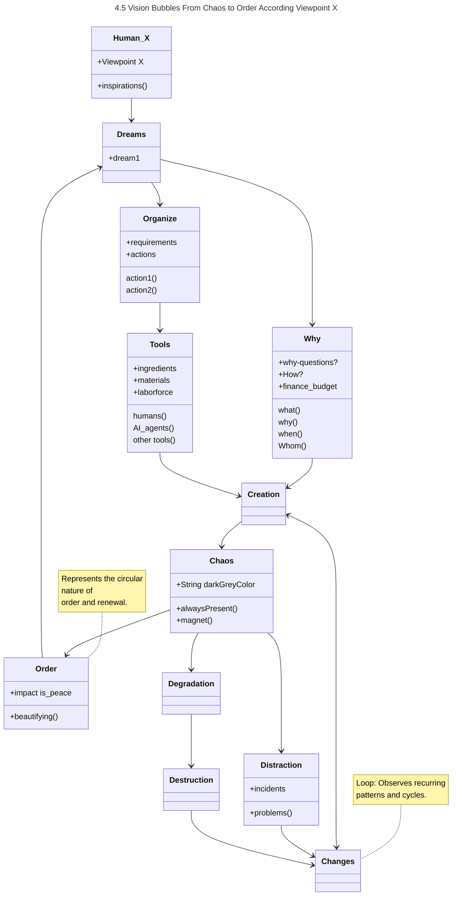
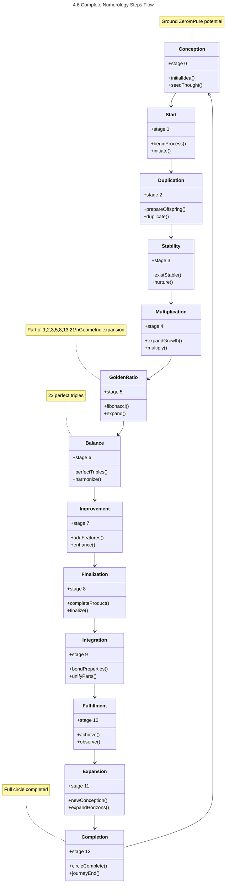
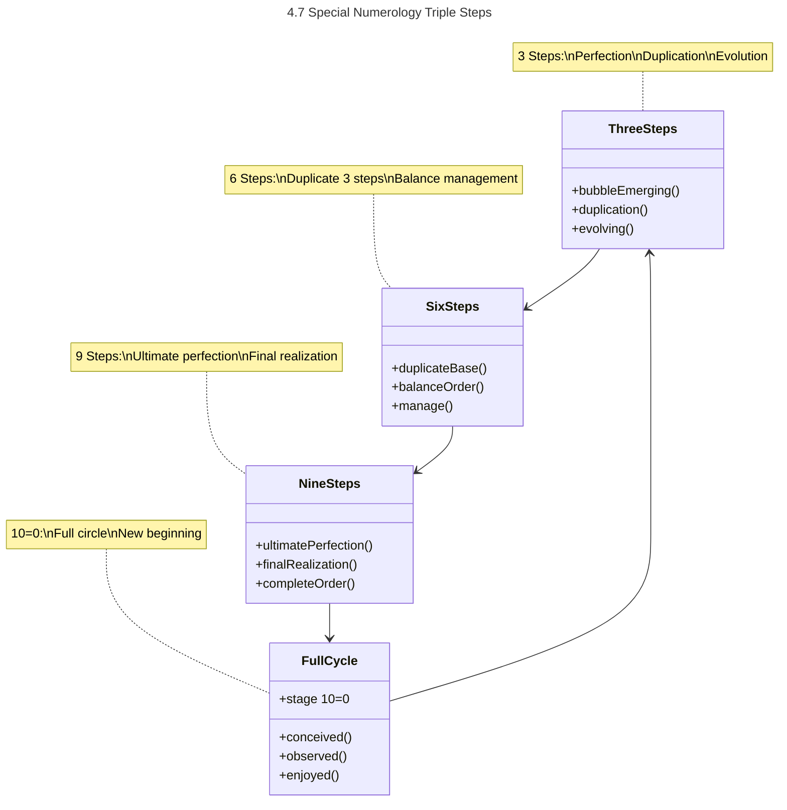

# 4.5 Vision Bubbles From Chaos to Order
## 5 work in progress
### Inspirations
From chaos to organized order, from real life situations to organized project order.

After some inspirations I wanted to create some objects and maybe subjects.
I want to visualize this in mermaid graphs.

# 4.6 Vision Bubbles From Chaos to Order
## 6 work in progress
### ZR LLM Inspiration /visions
AZR LLM Inspiration /visions;
- Started with a Main overview Mermaid graph "45 Vision Bubbles From Chaos to Order" as a baseline.
- Goal: Visions Representation in Mermaid Graphs "45.2 Vision Bubbles From Dreams to Creation Flow" Based On AZR LLM Inspiration /Visions.

# 4.6 Numerology Steps Flow

# 4.7 Triple Steps Approach

---

## References

- Detailed flow from **Dreams** to **Creation** is elaborated in:  
  [45.2 Vision Bubbles From Dreams to Creation Flow.md](45.1%20Vision%20Bubbles%20From%20Dreams%20to%20Creation%20Flow.md)

- Focused flow: `Dreams → Organize → Tools → Creation`

---

## Change Management

- When updating relationships in subgraphs, update this main graph and add a note about the change.
- Maintain cross-references for traceability.

//
