# 45.2 Vision Bubbles From Dreams to Creation Flow
## 1 work in progress Classdiagram
### inspirations
from chaos to organized order, from real life situations to organized project order.
i want to higlight the partlyflow of "dreams" to "creation" in another graph like flowchart and elaborate on it.
i want to visualize this in mermaid graphs.
AZR LLM Inspiration /visions;
- Started with a Main overview Mermaid graph "45 Vision Bubbles From Chaos to Order" as a baseline.
- Goal: Visions Representation in Mermaid Graphs "45.2 Vision Bubbles From Dreams to Creation Flow" Based On AZR LLM Inspiration /Visions.


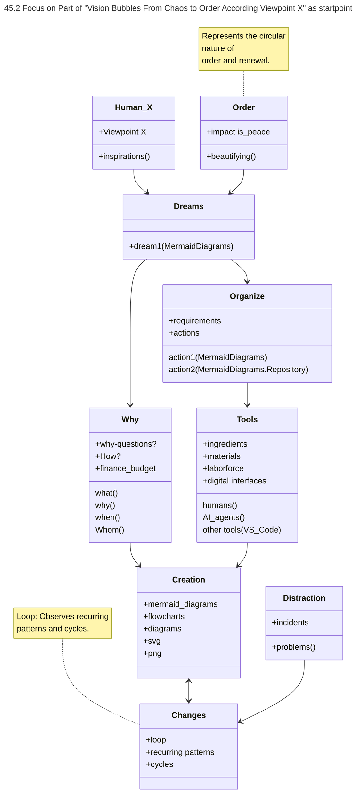
## 2.1 Work in Progress Flowchart (Update)

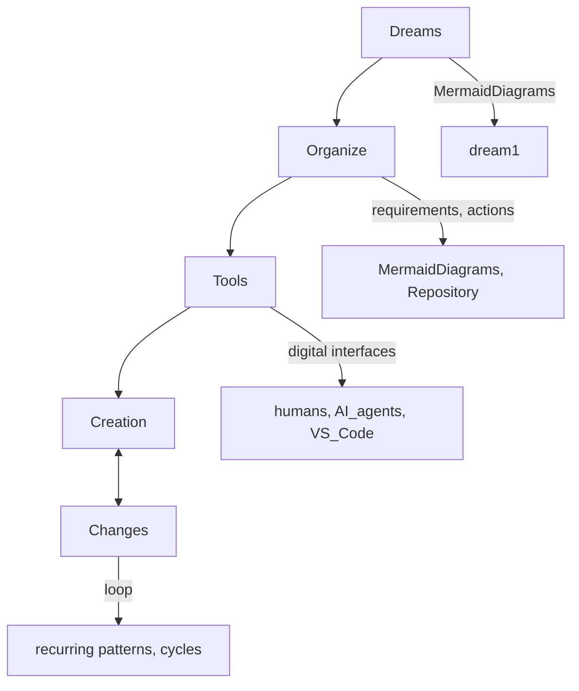
## 2.2 Work in Progress Flowchart (Update)

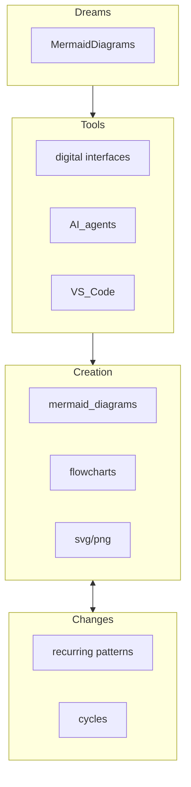

## 3 Work in Progress Tools Subclassified
### inspirations 2


## 3.1 Work in Progress Flowchart Component Interactions

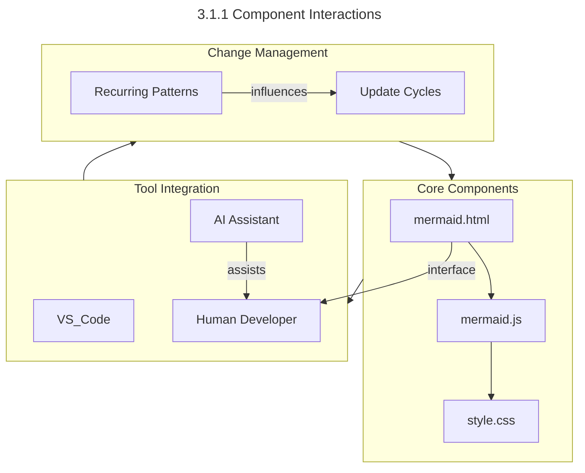

## 3.2 Work in Progress Flowchart Core Component Level Integration

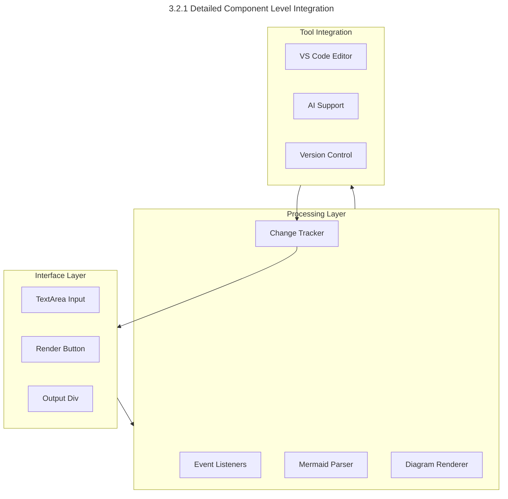


## 3.4 Work in Progress Flowchart
### Transformed to Flowchart type 4 (Component Level Detail)

This flowchart expands on the relationships between `mermaid.html` and `mermaid.js`, showing component-level interactions.

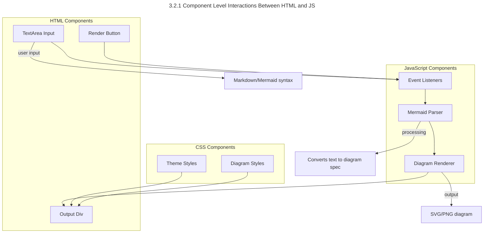

### 🔍 **Key Additions**
1. **Component Grouping**:
   - UI elements in HTML
   - Logic components in JavaScript
   - Styling elements in CSS

2. **Interaction Flow**:
   - User input handling
   - Data processing pipeline
   - Rendering process

3. **Styling Integration**:
   - Theme application
   - Diagram-specific styles

This expanded view helps visualize the internal workings and data flow between components.

## 3.5 Cross-Reference Index (Updated)

### 3.5.1 Diagram Evolution
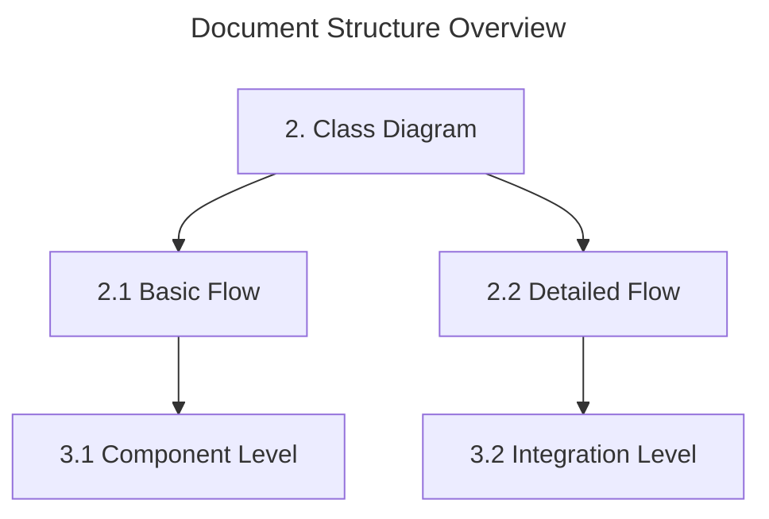

## 4. Work in Progress Flowchart Core Components At Element level

Core components element level details

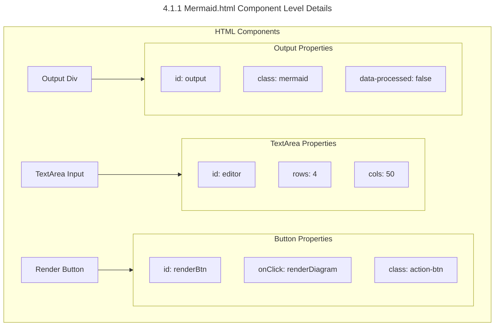

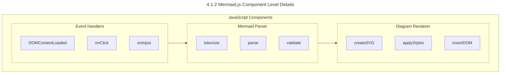

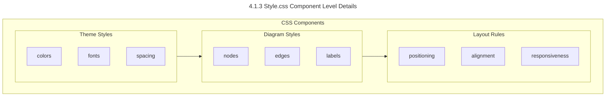

### 🔍 **Element Details**

1. **HTML Elements**
   - TextArea: Code input interface
   - Button: Triggers rendering
   - Output Div: Displays diagrams

2. **JavaScript Functions**
   - Event Handlers: User interaction
   - Parser: Code analysis
   - Renderer: Visual output

3. **CSS Rules**
   - Theme: Visual identity
   - Diagrams: Graph styling
   - Layout: Positioning


### 🔍 **Key Changes**
1. **Flowchart Direction**:
   - Changed from `LR` to `TD` to match the structure of **2.1**.
   - Nodes are now labeled with `["node name"]` for clarity.

2. **Notes as Inline Comments**:
   - Replaced the problematic `note` block with Mermaid's `%%` comment syntax.
   - Added detailed nodes (e.g., `mermaid.html.Details`) to explain file contents.

3. **Consistent Quoting**:
   - All node names use double quotes (`"mermaid.html"`) for consistency.

---

## 5. 🛠️ **Optional Enhancements**
1. **Add Subgraphs**:
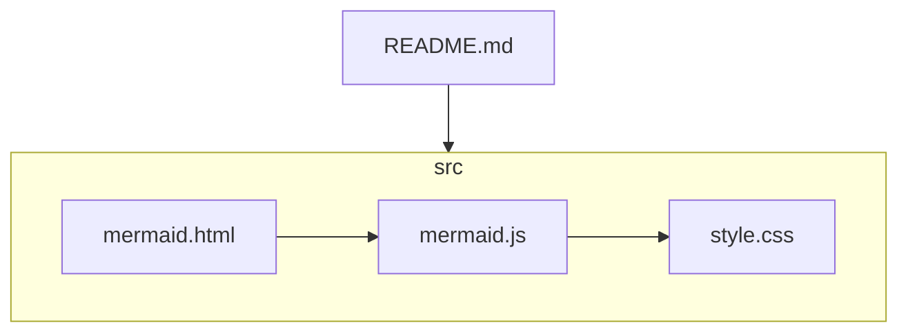

## 6. **Change Management**
- When you update a relationship in a subgraph, update the main graph and add a note about the change.
- Consider a "References" or "Related Diagrams" section in each file.

---

## 7. **Summary:**  
- Use unique, consistent names for entities.
- Cross-reference diagrams with comments/notes and links.
- Document changes and maintain backlinks for traceability.
- This way, you can always backtrack or propagate changes between overview and detailed diagrams.

For more, see your main file [45 2ision Bubbles From Chaos to Order.md](http://_vscodecontentref_/0).


## 8. Change Tracking Log

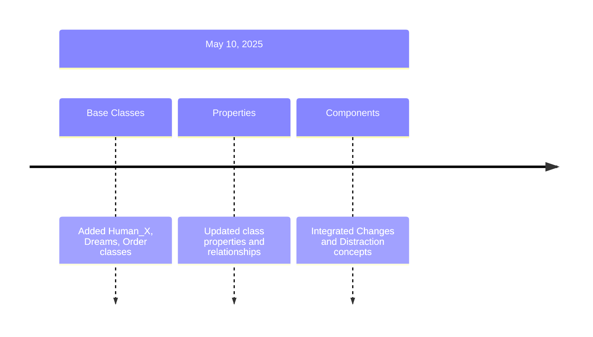

## 9. Updated References
1. **Class Diagram** (Section 2)
   - Added: `Human_X`, `Dreams`, `Order`, `Changes`, `Distraction`
   - Updated: Properties for all classes
   - New relationships: `Creation <--> Changes`

2. **Flowcharts** (Sections 2.1, 2.2)
   - Aligned with new class structure
   - Added detailed component interactions
   - Updated subgraph organization

3. **Component Integration** (Sections 3.1, 3.2)
   - Incorporated new class relationships
   - Added tool integration layer
   - Updated change management flow

## 10. Related Documents
- [45 2ision Bubbles From Chaos to Order.md](45%20Vision%20Bubbles%20From%20Chaos%20to%20Order.md) - Parent concept
- [45 2raph_Progress.md](45%20Graph_Progress.md) - Change tracking

## 11. Project Achievement Summary

### 11.1 Documentation Structure
```mermaid
---
title: Documentation Evolution Overview
---
flowchart TD
    subgraph Conceptual[Conceptual Level]
        dreams[Dreams to Creation Flow]
        class[Class Relationships]
    end
    
    subgraph Technical[Technical Implementation]
        comp[Component Structure]
        elem[Element Details]
    end
    
    subgraph Management[Project Management]
        track[Change Tracking]
        ref[Cross References]
    end

    Conceptual --> Technical
    Technical --> Management
    Management --> Conceptual
```

### 11.2 Key Accomplishments

1. **Conceptual Framework**
   - Dreams to Creation workflow visualization
   - Class relationships and interactions
   - Tool integration mapping

2. **Technical Documentation**
   - Component-level diagrams (HTML, JS, CSS)
   - Element-level details
   - Interaction flows

3. **Documentation Structure**
   - Clear hierarchy (Sections 1-10)
   - Consistent naming conventions
   - Cross-referencing system

4. **Change Management**
   - Timeline tracking
   - Version documentation
   - Relationship maintenance

### 11.3 Document Updates
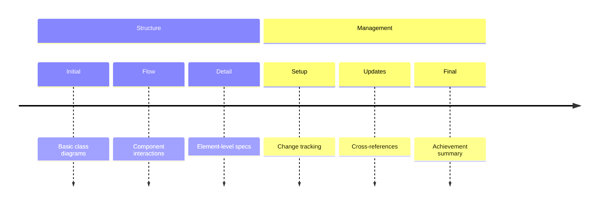

This summary represents our systematic approach from conceptual design through technical implementation to comprehensive documentation management.