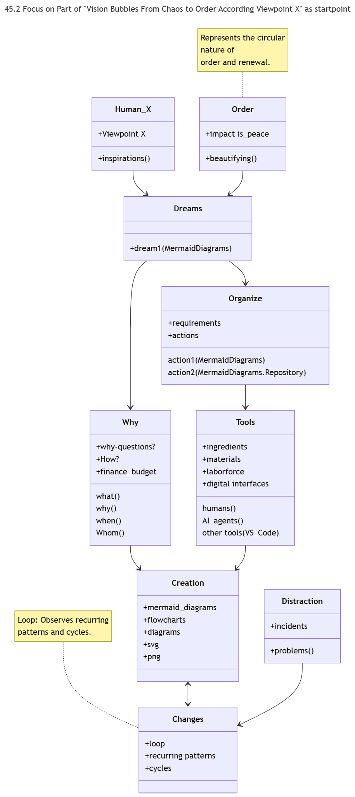
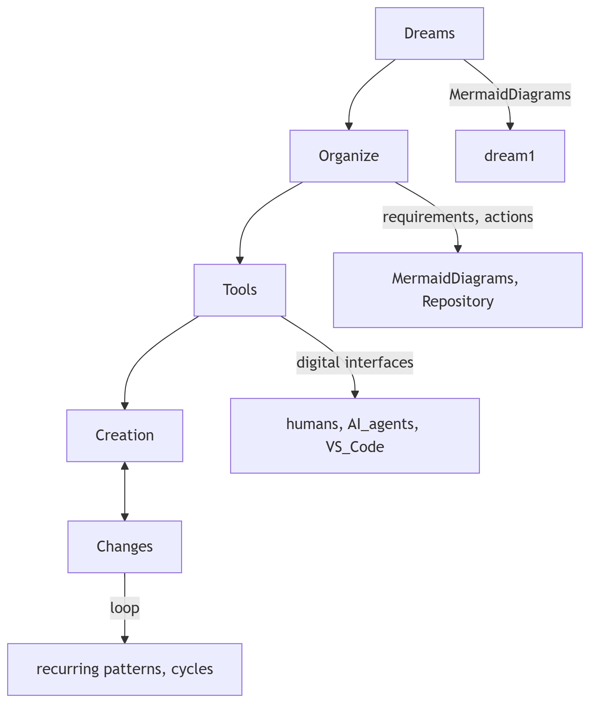

# PlayGround
Project Template

## Project Structure

```
PlayGround
├── 0Baseline
├── 1Rookie
├── 2Arcade
├── gitattributes
├── 45                          # AZR Project Root
│   ├── Project_basics.md
│   ├── Project_Progress.md
│   ├── Project_Prompt_input.txt
│   ├── project_Start.md
│   ├── README.md               # Main AZR documentation
│   ├── Vision Bubbles From Chaos to Order.md
│   ├── 45.2 Vision Bubbles From Dreams.md
│   ├── AZR_image.png          # AZR Logo
│   └── LICENSE                 # Project license
├── README.md                   # Main project documentation
└── .vscode
    └── settings.json           # VS Code & Mermaid settings
```

his structure now accurately reflects:

All visible folders including 0Baseline, 1Rookie, and 2Arcade
The complete contents of the 45 folder
Root level files like gitattributes
Maintains proper Markdown formatting

# 45.2 Vision Bubbles From Dreams to Creation Flow
## 1 work in progress Classdiagram
### inspirations
from chaos to organized order, from real life situations to organized project order.
i want to higlight the partlyflow of "dreams" to "creation" in another graph like flowchart and elaborate on it.
i want to visualize this in mermaid graphs.
AZR LLM Inspiration /visions;
- Started with a Main overview Mermaid graph "45 Vision Bubbles From Chaos to Order" as a baseline.
- Goal: Visions Representation in Mermaid Graphs "45.2 Vision Bubbles From Dreams to Creation Flow" Based On AZR LLM Inspiration /Visions.

 as startpoint.

## 2.1 Work in Progress Flowchart (Update)

 Based On AZR LLM Inspiration /Visions.

# 0Baseline
- Site is hosted at:  
https://github.com/RoysSpaceXL/PlayGround/blob/0BaseLine/0BaseLine/45.2%20Vision%20Bubbles%20From%20Dreams%20to%20Creation%20Flow.md  

- or link: [0Baseline; From Dreams to Creation Flow](/0BaseLine/45.2%20Vision%20Bubbles%20From%20Dreams%20to%20Creation%20Flow.md)
- The site is live at https://roysspacexl.github.io/PlayGround/
